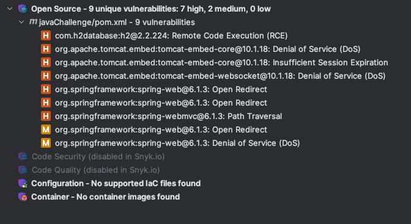

# Important information
The following repository is intended for technical tests, the use is confidential.

## General Dependencies

- Java 17
- Maven
- Docker

## Java 17

```
https://jdk.java.net/17/
```

```
Download (mac) 
https://www.oracle.com/cl/java/technologies/downloads/#java17```

```

```
Install (mac)
$ cd ~/Downloads $ tar xf openjdk-17.0.2_osx-x64_bin.tar.gz
```

Configure sudo mv jdk-17.0.2.jdk /Library/Java/JavaVirtualMachines/

```
## JAVA_HOME
```

Configure environment variable (path on Mac for jdk-17, may vary on other OS)

```
export JAVA_HOME=/Library/Java/JavaVirtualMachines/jdk-17.0.2.jdk/Contents/Home/
```


## Installation MAVEN !OPTIONAL

macOS
```
brew install maven
```

Generate maven wrapper
```
mvn -N wrapper:wrapper

```
This command creates the following files and directories:
`mvnw` and `mvnw.cmd`: Executable scripts for Unix/Mac and Windows, respectively.
`.mvn/wrapper/`: A directory containing the `maven-wrapper.jar` file and `maven-wrapper.properties`.

To configure `maven-wrapper.properties`
inside `.mvn/wrapper/maven-wrapper.properties` you can specify the version of Maven that the wrapper should download and use. 
For example, to use Maven 3.9.6, you can specify the following:
```
distributionUrl=https://repo.maven.apache.org/maven2/org/apache/maven/apache-maven/3.9.6/apache-maven-3.9.6-bin.zip

```


Clean project:
```
./mvnw clean install

```

The following files are included to ensure that when cloning the repository, the project is built without the need to have Maven installed locally.
```
mvnw
mvnw.cmd
.mvn/wrapper/maven-wrapper.jar
.mvn/wrapper/maven-wrapper.properties
```

### Clean Maven

`mvn clean`
### Compilación Maven

`mvn compile`
### Test Maven

`mvn test`

### Test with coverage(jacoco)

`mvn clean test`

### Build Maven

`mvn package`

## Run 

`java -jar target/prueba-0.0.1-SNAPSHOT.jar`


## Provider services
### Server
Server is available on port: 8080
to start on another port you can modify 
```
server:
  port: 8080

```
### Endpoints

The following **endpoint** is provided:

_Get price_ according to a chain (**brandId**), product (**productId**), and the date to query (**applicationDate**).
The query parameters are detailed below:
* _brandId_: being a natural __integer__ number (Example: 1).
* _productId_: being a natural __integer__ number (Example: 35455).
* _applicationDate_: being a date selected in __ISO 8601__ format (Example: 2020-06-14T19:00:59).
  - The detailed format below:
    * _2020-06-14_: The date is composed of year-month-day in the following way YYYY-MM-DD (2020-06-14)
    * _T_: The time separator, indicating the start of the time component.
    * _19:00:59_: The time component is composed of the hour (19), minutes (00), and seconds (59), all separated by colons (translated to ASCII as %3A).

As a response, we have internally the identification that if there are two priceDTOS for a given time, 
the one with the highest priority is obtained, identified in the __PRIORITY__ field, with the one farthest from 0 being the highest priority.

#### CURL

Service response
request with correct parameters
````
curl --location --request GET 'localhost:8080/prices?applicationDate=2020-06-14T19%3A00%3A59&productId=35455&brandId=1'
````
response
```
{
    "priceList": 1,
    "brandId": 1,
    "startDate": "2020-06-14 00:00:00",
    "endDate": "2020-12-31 23:59:59",
    "productId": 35455,
    "priority": 0,
    "priceResponse": "35,50",
    "curr": "EUR"
}
```
Request __Parameters missing__
````
curl --location --request GET 'localhost:8080/prices?applicationDate=2020-06-14T19%3A00%3A59&brandId=1'
````
Response with status 400
````
{
    "status": 400,
    "message": "Error found: Required request parameter 'productId' for method parameter type Integer is not present",
    "data": null
}

````
Request __Price not found__
````
curl --location --request GET 'localhost:8080/prices?applicationDate=2020-06-14T19%3A00%3A59&productId=35454&brandId=1'
````
Response with status 404
```
{
    "status": 404,
    "message": "Price not found: Applicable priceResponse not found for productId: 35454, brandId: 1, and date: 2020-06-14T19:00:59.",
    "data": null
}
```

### Docker

To generate a Docker build, we can:
Generate build
```
docker build -t prueba .
```
Run container
```
docker run -d --name prueba-cont -p 8080:8080 prueba
```
Stop container
```
docker stop prueba-cont
```
Analyze vulnerabilities
```
docker scout quickview

```

### Reference Documentation

Known and tested vulnerabilities with __Snyk.io__



#### Swagger
Swagger URL.

``
http://localhost:8080/swagger-ui/index.html
``

Location of openapi.json, extracted code and annotations from swagger to clean up unnecessary code.
```
swagger/openapi.json
```

#### Health Checker

Access to Health __endpoint__

```
http://localhost:8080/actuator/health
```
